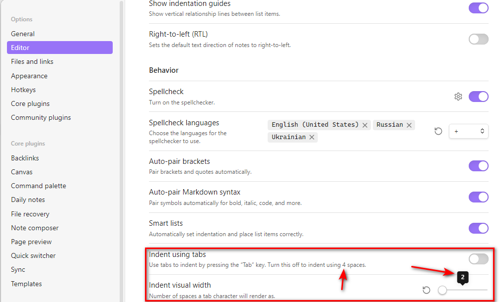

# Fix Tab Size

This is a plugin for [Obsidian](https://obsidian.md/) that fixes tab size according to the settings.

As reported on the [forum](https://forum.obsidian.md/t/customizing-universal-tab-size/7998/2):

Obsidian has setting for tab size:



But Obsidian partially ignores this setting and always inserts 4 spaces when you press `Tab` button in the editor, if you have setting `Indent using tabs` disabled.

This plugin fixes the editor tab size making it to match `Indent visual width` setting.

## Installation

The plugin is not available in [the official Community Plugins repository](https://obsidian.md/plugins) yet.

### Beta versions

To install the latest beta release of this plugin (regardless if it is available in [the official Community Plugins repository](https://obsidian.md/plugins) or not), follow these steps:

1. Ensure you have the [BRAT plugin](https://obsidian.md/plugins?id=obsidian42-brat) installed and enabled.
2. Click [Install via BRAT](https://intradeus.github.io/http-protocol-redirector?r=obsidian://brat?plugin=https://github.com/mnaoumov/obsidian-fix-tab-size).
3. An Obsidian pop-up window should appear. In the window, click the `Add plugin` button once and wait a few seconds for the plugin to install.

## Debugging

By default, debug messages for this plugin are hidden.

To show them, run the following command in the `DevTools Console`:

```js
window.DEBUG.enable('fix-tab-size');
```

For more details, refer to the [documentation](https://github.com/mnaoumov/obsidian-dev-utils/blob/main/docs/debugging.md).

## Support

<a href="https://www.buymeacoffee.com/mnaoumov" target="_blank"></a>

## License

© [Michael Naumov](https://github.com/mnaoumov/)
