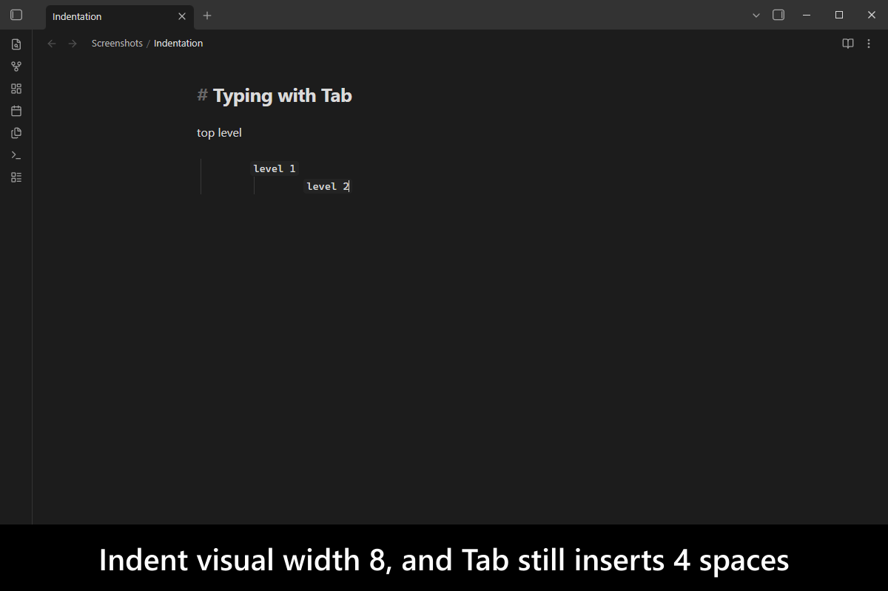
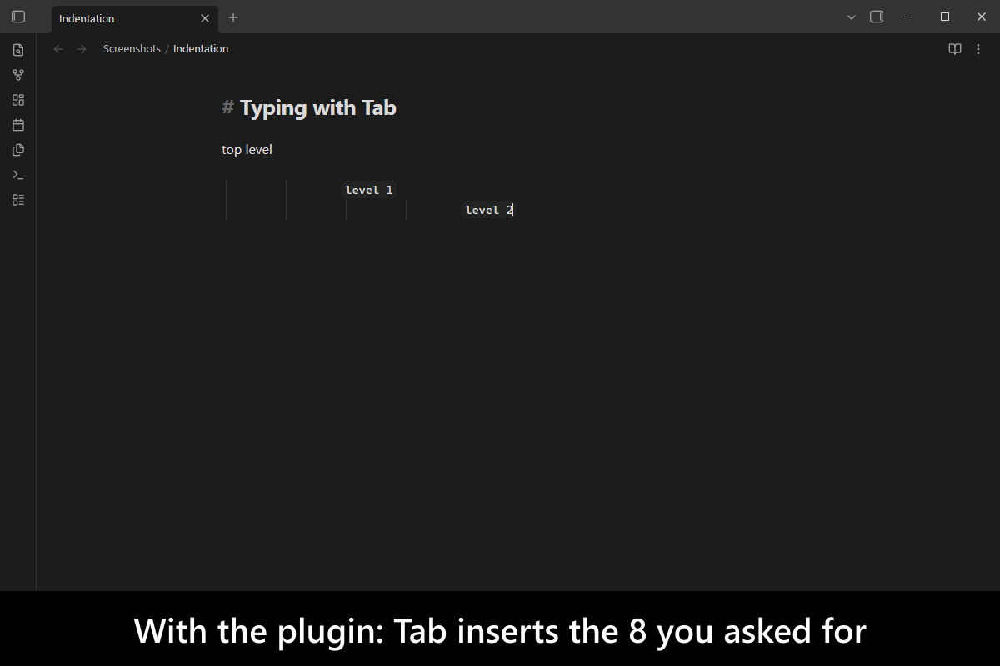
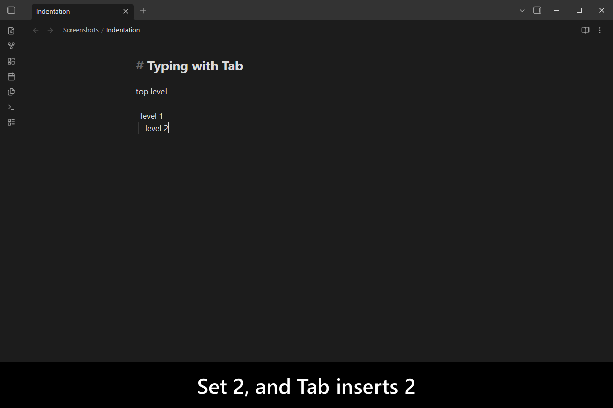
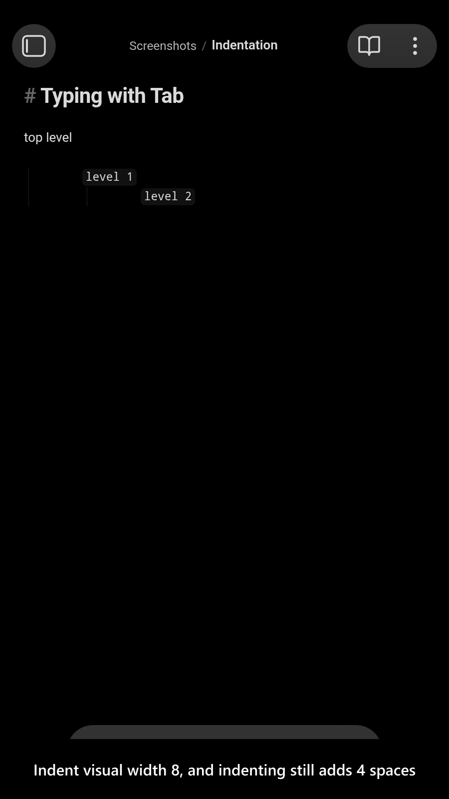
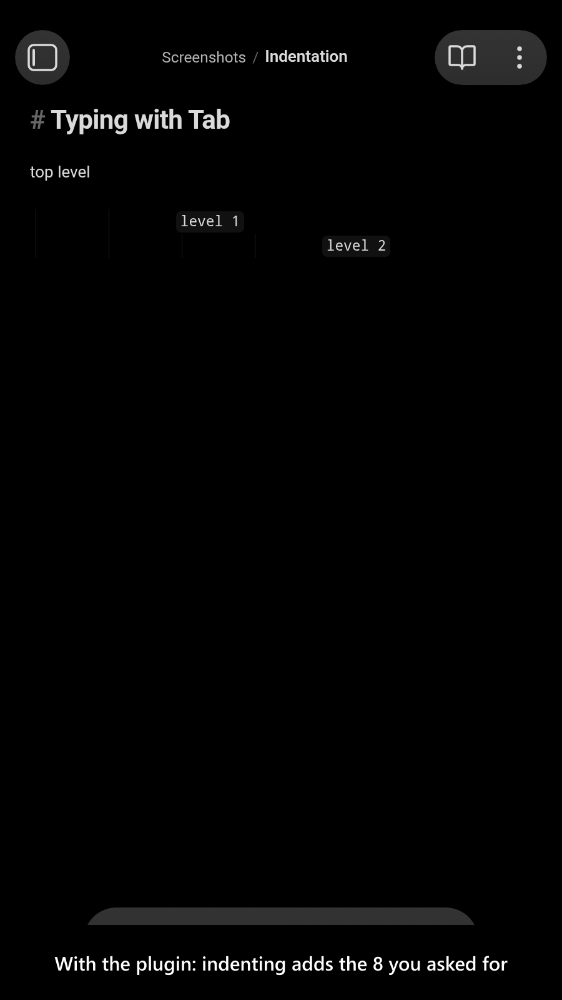
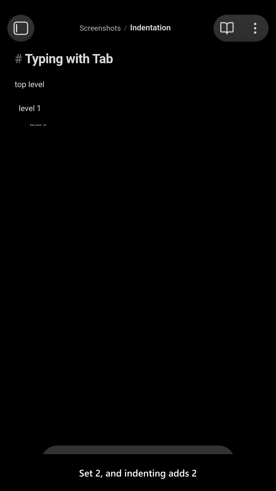

# Fix Tab Size

[](https://www.buymeacoffee.com/mnaoumov)
[](https://github.com/mnaoumov/obsidian-fix-tab-size/releases)
[](https://github.com/mnaoumov/obsidian-fix-tab-size/releases)
[](https://github.com/mnaoumov/obsidian-fix-tab-size)

[Obsidian](https://obsidian.md/) has an **Indent visual width** setting, and then ignores it for real
tab characters: press `Tab` with `Indent using tabs` on and the editor always draws that tab at its own
fixed width, whatever you configured. Tab-indented text therefore lines up differently in Obsidian than
in every other editor that opens the same file.

This plugin makes the editor render each tab at the width you actually set, so the indentation you see
is the indentation you chose.

Reported on the [forum](https://forum.obsidian.md/t/customizing-universal-tab-size/7998/2).

<!-- markdownlint-disable MD033 -->

<a href="images/screenshots/screenshot-desktop-1.png"></a>

<details>
<summary>More screenshots</summary>

<a href="images/screenshots/screenshot-desktop-2.png"></a>
<a href="images/screenshots/screenshot-desktop-3.png"></a>
<a href="images/screenshots/screenshot-mobile-1.png"></a>
<a href="images/screenshots/screenshot-mobile-2.png"></a>
<a href="images/screenshots/screenshot-mobile-3.png"></a>

</details>

<!-- markdownlint-enable MD033 -->

## Demo vault

**The documentation is a demo vault.** The feature has a note that explains what it does and why you
would want it, with a tab-indented sample to watch as you change the setting.

**[Start reading here](<./demo-vault/00 Start.md>)** — it is plain markdown, so it works on GitHub with
nothing installed.

A copy of the vault ships with every release. You can access it via any of the following:

1. Running the **Fix Tab Size: Open demo vault** command.
2. Downloading `fix-tab-size-demo-vault-<version>.zip` (`<version>` is the release version) from the [Releases](https://github.com/mnaoumov/obsidian-fix-tab-size/releases).
3. Browsing its source in [`demo-vault/`](./demo-vault/README.md) in this repository.

## What it does

- **Tabs render at your configured width**, matching `Indent visual width` instead of Obsidian's fixed
  one. There is nothing to configure in the plugin itself.
  [01 Fix tab size](<./demo-vault/01 Fix tab size.md>)

## Installation

The plugin is available in [the official Community Plugins repository](https://community.obsidian.md/plugins/fix-tab-size).

### Beta versions

To install the latest beta release of this plugin (regardless if it is available in [the official Community Plugins repository](https://community.obsidian.md) or not), follow these steps:

1. Ensure you have the [BRAT plugin](https://community.obsidian.md/plugins/obsidian42-brat) installed and enabled.
2. Click [Install via BRAT](https://intradeus.github.io/http-protocol-redirector?r=obsidian://brat?plugin=https://github.com/mnaoumov/obsidian-fix-tab-size).
3. An Obsidian pop-up window should appear. In the window, click the `Add plugin` button once and wait a few seconds for the plugin to install.

## Debugging

By default, debug messages for this plugin are hidden.

To show them, run the following command:

```js
window.DEBUG.enable('fix-tab-size');
```

For more details, refer to the [documentation](https://mnaoumov.dev/obsidian-dev-utils/guides/debugging/).

## Changelog

All notable changes to this project will be documented in the [CHANGELOG](./CHANGELOG.md).

## Contributing

Contributions are welcome — see [CONTRIBUTING](./CONTRIBUTING.md) to get set up.

## Support

<!-- markdownlint-disable MD033 -->

<a href="https://www.buymeacoffee.com/mnaoumov" target="_blank"></a>

<!-- markdownlint-enable MD033 -->

## My other Obsidian resources

[See my other Obsidian resources](https://github.com/mnaoumov/obsidian-resources).

## License

© [Michael Naumov](https://github.com/mnaoumov/)
